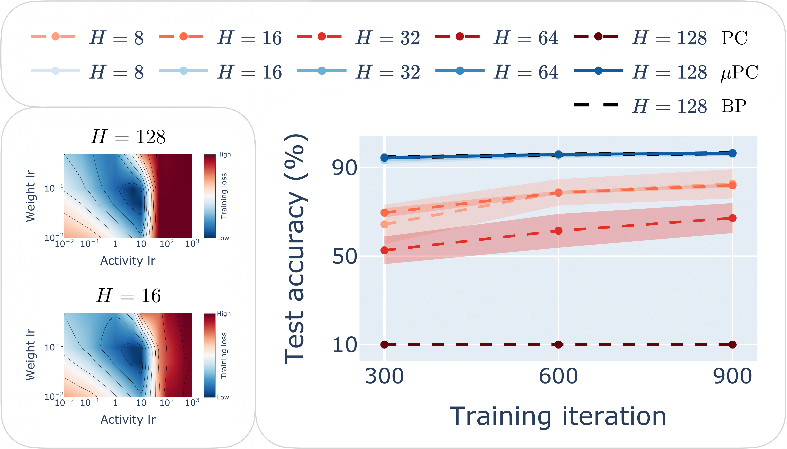
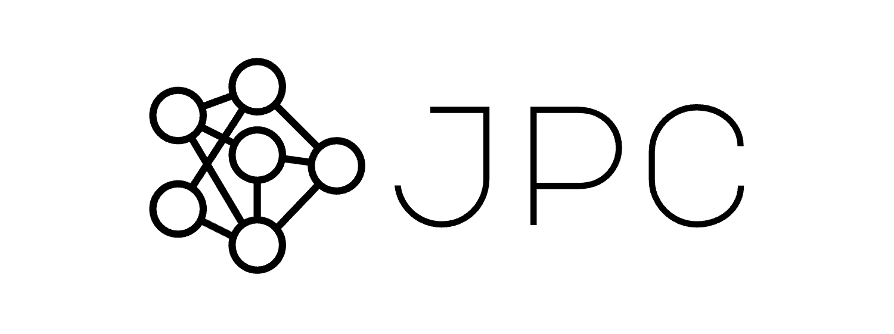
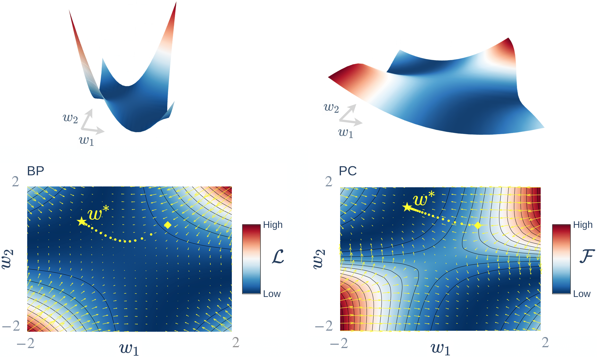

Hi! I’m Francesco.

I’m currently a PhD student in Theoretical Neuroscience and Machine Learning at the University of Sussex, supervised 
by [Christopher Buckley](https://scholar.google.com/citations?user=nWuZ0XcAAAAJ&hl=en&oi=ao) and [Anil Seth
](https://scholar.google.com/citations?user=3eJCZCkAAAAJ&hl=en&oi=ao). My PhD is about scaling a brain-inspired local learning algorithm called "predictive coding", as a potentially more efficient alternative to standard backpropagation. I use both theory and experiment, with a focus on optimisation theory.

I recently interned as an Applied Scientist at Amazon, helping to improve their model forecasts to deliver packages 
throughout Europe more efficiently. During my undergrad, I worked as a research assistant in [Ashok Jansari](https://scholar.google.com/citations?hl=en&user=vwtx4TsAAAAJ&view_op=list_works&sortby=pubdate)’s 
lab at Goldsmiths, University of London, helping to develop a face memory test aimed at people with both poor and 
exceptional face recognition abilities. I also interned in the lab of [Devin Terhune](https://scholar.google.com/citations?user=rBgJFwYAAAAJ&hl=en&oi=ao), 
using machine learning tools to differentiate the subjective experiences associated with different psychedelic drugs.

Outside of work, I enjoy running, swimming and playing football, and am always up for a physical challenge!

-----------

# News

## 🔥 Training 100+ layer networks with a local algorithm
*May 2025*

  

We introduce [μPC](https://arxiv.org/abs/2505.13124), a reparameterisation of 
predictive coding that allows stable training of 100+ layer residual networks 
with zero-shot hyperparameter transfer. See [this post](https://francesco-innocenti.github.io/posts/2025/05/20/Scaling-Predictive-Coding-to-100+-Layer-Networks/) 
for a summary. Code [here](https://github.com/thebuckleylab/jpc/tree/main/experiments/mupc_paper).

## 💻‍ Introducing JPC
*December 2024*

  

⭐️ Our lab just released [JPC
](https://github.com/thebuckleylab/jpc), a **J**AX library for training neural 
networks with **P**redictive **C**oding. See this [pre-print
](https://arxiv.org/abs/2412.03676) for more details.

## 🇨🇦 Paper accepted at NeurIPS 2024
*September 2024*

  

Our paper [Only Strict Saddles in the Energy Landscape of Predictive Coding Networks?
](https://papers.nips.cc/paper_files/paper/2024/hash/6075fc6540b9a3cb951752099efd86ef-Abstract-Conference.html) has been 
accepted at NeurIPS 2024! See [this blog post](https://francesco-innocenti.github.io/posts/2024/10/01/The-Energy-Landscape-of-Predictive-Coding-Networks/) 
for the key takeaways.

## 🇪🇸 Applied Scientist Intern at Amazon
*April 2024*

I recently completed an internship as Applied Scientist at Amazon, in Barcelona. 
I wrote about my experience [here](https://francesco-innocenti.github.io/posts/2024/04/27/Amazon-Internship/) 
if you're interested.

## 🏆 Best Workshop Paper Award at ICML 2023
*June 2023*

  

I will be at ICML 2023 in Hawaii to present my work on [Understanding Predictive Coding as a Second-Order Trust-Region Method](https://openreview.net/forum?id=x7PUpFKZ8M), 
which won a Best Paper Award at the [Workshop on Localized Learning](https://sites.google.com/view/localized-learning-workshop).
You can rewatch my talk [here](https://icml.cc/virtual/2023/workshop/21484) or read [my blog post](https://francesco-innocenti.github.io/posts/2023/08/10/PC-as-a-2nd-Order-Method/)
for the key ideas.

<blockquote class="twitter-tweet">
Honoured to share that my first PhD paper &quot;Understanding Predictive Coding as a Second-Order Trust-Region Method&quot; (<a href="https://t.co/xP3m0aZS99">https://t.co/xP3m0aZS99</a>) won a Best Paper Award at the ICML 2023 Workshop on Localized Learning! 🎉 <a href="https://twitter.com/hashtag/icml2023?src=hash&amp;ref_src=twsrc%5Etfw">#icml2023</a>  If this piques your interest, read on 1/14👇🧵
&mdash; Francesco Innocenti (@InnocFrancesco) <a href="https://twitter.com/InnocFrancesco/status/1680981476672774144?ref_src=twsrc%5Etfw">July 17, 2023</a></blockquote> 
