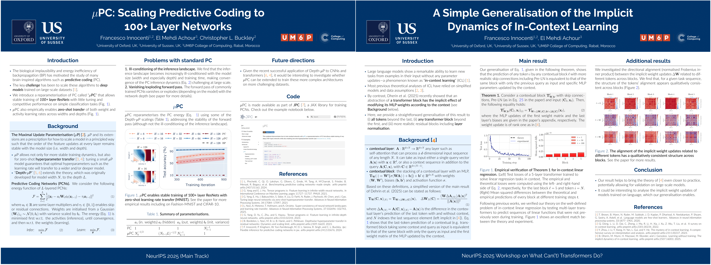

Hi! I’m Francesco.

I recently started as a Postdoctoral Researcher at the University of Oxford in 
the group of [Rafal Bogacz](https://scholar.google.com/citations?user=m02-44gAAAAJ&hl=en&oi=ao). 
Previously, I did my PhD in Machine Learning and Theoretical Neuroscience at the 
University of Sussex, supervised by [Christopher Buckley](https://scholar.google.com/citations?user=nWuZ0XcAAAAJ&hl=en&oi=ao) 
and [Anil Seth](https://scholar.google.com/citations?user=3eJCZCkAAAAJ&hl=en&oi=ao). 
I also interned as an Applied Scientist at Amazon, helping to improve their 
model forecasts to deliver packages throughout Europe more efficiently.

My research focuses on understanding the training dynamics and scaling 
behaviour of artificial and biological neural networks. Among other 
contributions, my work unlocked the training of 100+ layer networks with a 
local learning algorithm. I like to understand things through the lens of 
optimisation theory, and am broadly interested in energy-based models, 
time-series forecasting, and all things AI-related.

Outside of work, I enjoy swimming and calisthenics, and am always up for a 
physical challenge!

-----------

# News

## 🇬🇧 Postdoctoral Researcher at the University of Oxford
*October 2025*

I am excited to share that in November I will be starting as a Postdoctoral 
Researcher in the group of Professor [Rafal Bogacz](https://scholar.google.com/citations?user=m02-44gAAAAJ&hl=en&oi=ao).

## 🇲🇦 Visiting Researcher at UM6P, Morocco
*October 2025*

I am pleased to share that, from October 21st to November 1st, I will be 
visiting my amazing collaborator, [El Mehdi Achour](https://scholar.google.com/citations?user=A-i6nwgAAAAJ&hl=en), 
at UM6P in Morocco, to work on LLM mixture of experts.

## 🇺🇸 Papers accepted at NeurIPS 2025 (San Diego)
*September 2025*

  

I will be at NeurIPS this year in San Diego to present two papers: 
[μPC: Scaling Predictive Coding to 100+ Layer Networks](https://openreview.net/forum?id=lSLSzYuyfX&referrer=%5Bthe%20profile%20of%20Francesco%20Innocenti%5D(%2Fprofile%3Fid%3D~Francesco_Innocenti1)) 
(main track) and [A Simple Generalisation of the Implicit Dynamics of In-Context 
Learning](https://arxiv.org/abs/2512.11255) (workshop). The first introduces a 
reparameterisation of predictive coding that allows stable training of 100+  
layer residual networks on simple tasks with zero-shot hyperparameter transfer, 
while the second provides a simple theoretical extension of a recent in-context 
learning result for transformers.

## 🚨 Paper republished in Journal of Statistical Mechanics 
*July 2025*

A slightly updated version of our NeuIPS 2024 paper on the geometry of the 
energy landscape of predictive coding networks has just been republished [here](https://iopscience.iop.org/article/10.1088/1742-5468/ade2eb) 
in the ***Journal of Statistical Mechanics: 
Theory and Experiment*** as part of a Special Issue on ***Machine Learning 2025***.

## 💻‍ Introducing JPC
*December 2024*

  

⭐️ Our lab just released [JPC
](https://github.com/thebuckleylab/jpc), a **J**AX library for training neural 
networks with **P**redictive **C**oding. See this [pre-print
](https://arxiv.org/abs/2412.03676) for more details.

## 🇨🇦 Paper accepted at NeurIPS 2024
*September 2024*

  

Our paper [Only Strict Saddles in the Energy Landscape of Predictive Coding Networks?
](https://papers.nips.cc/paper_files/paper/2024/hash/6075fc6540b9a3cb951752099efd86ef-Abstract-Conference.html) has been 
accepted at NeurIPS 2024! See [this blog post](https://francesco-innocenti.github.io/posts/2024/10/01/The-Energy-Landscape-of-Predictive-Coding-Networks/) 
for the key takeaways.

## 🇪🇸 Applied Scientist Intern at Amazon
*April 2024*

I recently completed an internship as Applied Scientist at Amazon, in Barcelona. 
I wrote about my experience [here](https://francesco-innocenti.github.io/posts/2024/04/27/Amazon-Internship/) 
if you're interested.

## 🏆 Best Workshop Paper Award at ICML 2023
*June 2023*

  

I will be at ICML 2023 in Hawaii to present my work on [Understanding Predictive Coding as a Second-Order Trust-Region Method](https://openreview.net/forum?id=x7PUpFKZ8M), 
which won a Best Paper Award at the [Workshop on Localized Learning](https://sites.google.com/view/localized-learning-workshop).
You can rewatch my talk [here](https://icml.cc/virtual/2023/workshop/21484) or read [my blog post](https://francesco-innocenti.github.io/posts/2023/08/10/PC-as-a-2nd-Order-Method/)
for the key ideas.

<blockquote class="twitter-tweet">
Honoured to share that my first PhD paper &quot;Understanding Predictive Coding as a Second-Order Trust-Region Method&quot; (<a href="https://t.co/xP3m0aZS99">https://t.co/xP3m0aZS99</a>) won a Best Paper Award at the ICML 2023 Workshop on Localized Learning! 🎉 <a href="https://twitter.com/hashtag/icml2023?src=hash&amp;ref_src=twsrc%5Etfw">#icml2023</a>  If this piques your interest, read on 1/14👇🧵
&mdash; Francesco Innocenti (@InnocFrancesco) <a href="https://twitter.com/InnocFrancesco/status/1680981476672774144?ref_src=twsrc%5Etfw">July 17, 2023</a></blockquote> 
